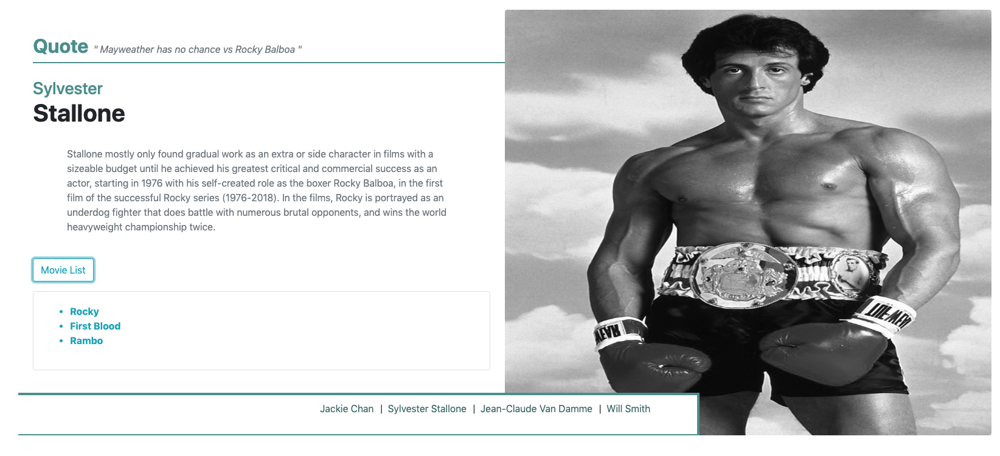
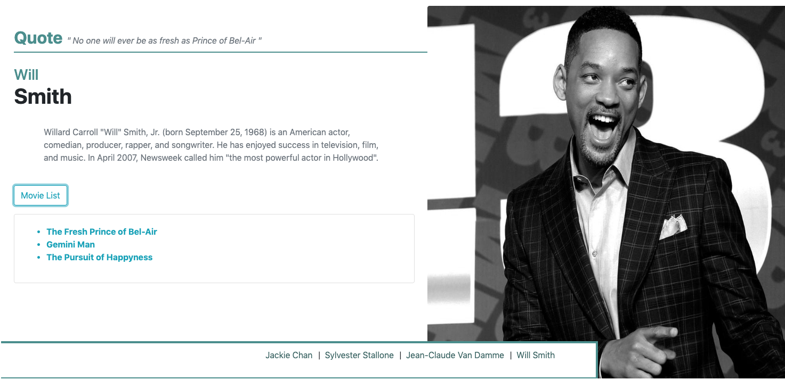

# Movie Stars using Pug

This project I'm using:
* Node express
* Pug (More information on Pug can be found here:
[Pug](https://pugjs.org/api/getting-started.html))
* Bootstrap
* Nodemon - using npm run watch to see my changes live instead of having to kill/start program for each update.
* Used GIMP to edit the images

Server.js is reading data from actors.json file. I'm rendering the front end with Pug and Bootstrap.

Movie list button - is a bootstrap button that expands with the specific actors list of movies they starred in. 

## Screenshot example

## How to run

1. Clone repo to your local machine.
2. cd into the repo.
3. run `npm install` to install all dependencies.
4. run `npm start` to start the app.
5. Open web browser and input this url localhost:3000
